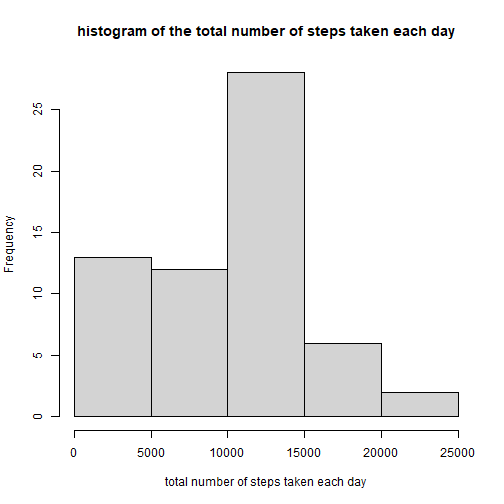
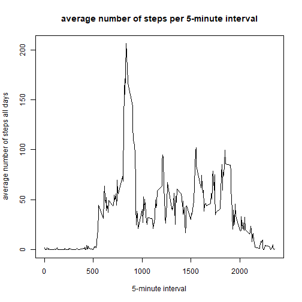
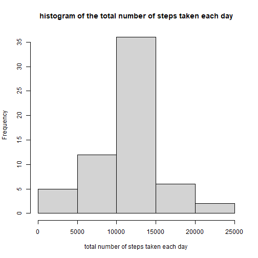
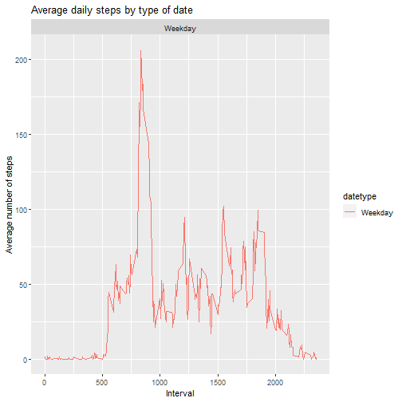

PA1_template.Rmd
=============================================================================

Loading the data


```r
activity <- read.csv("activity.csv")
```

preprocessing the data


```r
activity$date <- as.POSIXct(activity$date, "%Y-%m-%d", format = "%Y-%m-%d", tz = "")
weekday <- weekdays(activity$date)
activity <- cbind(activity,weekday)
str(activity)
```

```
## 'data.frame':	17568 obs. of  4 variables:
##  $ steps   : int  NA NA NA NA NA NA NA NA NA NA ...
##  $ date    : POSIXct, format: "2012-10-01" "2012-10-01" ...
##  $ interval: int  0 5 10 15 20 25 30 35 40 45 ...
##  $ weekday : chr  "lundi" "lundi" "lundi" "lundi" ...
```

What is mean total number of steps taken per day?

Calculate the total number of steps taken per day


```r
stepsperday <- with(activity, aggregate(steps, by = list(date), FUN = sum, na.rm = TRUE))
colnames(stepsperday) <- c("date", "steps")
stepsperday
```

```
##          date steps
## 1  2012-10-01     0
## 2  2012-10-02   126
## 3  2012-10-03 11352
## 4  2012-10-04 12116
## 5  2012-10-05 13294
## 6  2012-10-06 15420
## 7  2012-10-07 11015
## 8  2012-10-08     0
## 9  2012-10-09 12811
## 10 2012-10-10  9900
## 11 2012-10-11 10304
## 12 2012-10-12 17382
## 13 2012-10-13 12426
## 14 2012-10-14 15098
## 15 2012-10-15 10139
## 16 2012-10-16 15084
## 17 2012-10-17 13452
## 18 2012-10-18 10056
## 19 2012-10-19 11829
## 20 2012-10-20 10395
## 21 2012-10-21  8821
## 22 2012-10-22 13460
## 23 2012-10-23  8918
## 24 2012-10-24  8355
## 25 2012-10-25  2492
## 26 2012-10-26  6778
## 27 2012-10-27 10119
## 28 2012-10-28 11458
## 29 2012-10-29  5018
## 30 2012-10-30  9819
## 31 2012-10-31 15414
## 32 2012-11-01     0
## 33 2012-11-02 10600
## 34 2012-11-03 10571
## 35 2012-11-04     0
## 36 2012-11-05 10439
## 37 2012-11-06  8334
## 38 2012-11-07 12883
## 39 2012-11-08  3219
## 40 2012-11-09     0
## 41 2012-11-10     0
## 42 2012-11-11 12608
## 43 2012-11-12 10765
## 44 2012-11-13  7336
## 45 2012-11-14     0
## 46 2012-11-15    41
## 47 2012-11-16  5441
## 48 2012-11-17 14339
## 49 2012-11-18 15110
## 50 2012-11-19  8841
## 51 2012-11-20  4472
## 52 2012-11-21 12787
## 53 2012-11-22 20427
## 54 2012-11-23 21194
## 55 2012-11-24 14478
## 56 2012-11-25 11834
## 57 2012-11-26 11162
## 58 2012-11-27 13646
## 59 2012-11-28 10183
## 60 2012-11-29  7047
## 61 2012-11-30     0
```

Make a histogram of the total number of steps taken each day


```r
hist(stepsperday$steps, main = "histogram of the total number of steps taken each day", xlab = "total number of steps taken each day")
```



Calculate and report the mean of the total number of steps taken per day


```r
mymean <- mean(stepsperday$steps)
mymean
```

```
## [1] 9354.23
```

Calculate and report the median of the total number of steps taken per day


```r
mymedian <- median(stepsperday$steps)
mymedian
```

```
## [1] 10395
```

What is the average daily activity pattern?

Make a time series plot of the 5-minute interval and the average number of steps taken, averaged across all days


```r
averagestepsperday <- aggregate(activity$steps, by=list(activity$interval), FUN=mean, na.rm=TRUE)
names(averagestepsperday) <- c("interval", "mean")
plot(averagestepsperday$interval, averagestepsperday$mean, type = "l", xlab="5-minute interval", ylab="average number of steps all days", main="average number of steps per 5-minute interval")
```



Which 5-minute interval, on average across all the days in the dataset, contains the maximum number of steps?


```r
averagestepsperday[which.max(averagestepsperday$mean), ]$interval
```

```
## [1] 835
```

Imputing missing values

Calculate and report the total number of missing values in the dataset


```r
mysumNA <- sum(is.na(activity$steps) == TRUE)
mysumNA
```

```
## [1] 2304
```

Create a new dataset that is equal to the original dataset but with the missing data filled in


```r
newactivity <- averagestepsperday$mean[match(activity$interval, averagestepsperday$interval)]
newactivity <- transform(activity, steps = ifelse(is.na(activity$steps), yes = newactivity, no = activity$steps))
allactivity <- aggregate(steps ~ date, newactivity, sum)
colnames(allactivity) <- c("date", "stepsbyday")
allactivity
```

```
##          date stepsbyday
## 1  2012-10-01   10766.19
## 2  2012-10-02     126.00
## 3  2012-10-03   11352.00
## 4  2012-10-04   12116.00
## 5  2012-10-05   13294.00
## 6  2012-10-06   15420.00
## 7  2012-10-07   11015.00
## 8  2012-10-08   10766.19
## 9  2012-10-09   12811.00
## 10 2012-10-10    9900.00
## 11 2012-10-11   10304.00
## 12 2012-10-12   17382.00
## 13 2012-10-13   12426.00
## 14 2012-10-14   15098.00
## 15 2012-10-15   10139.00
## 16 2012-10-16   15084.00
## 17 2012-10-17   13452.00
## 18 2012-10-18   10056.00
## 19 2012-10-19   11829.00
## 20 2012-10-20   10395.00
## 21 2012-10-21    8821.00
## 22 2012-10-22   13460.00
## 23 2012-10-23    8918.00
## 24 2012-10-24    8355.00
## 25 2012-10-25    2492.00
## 26 2012-10-26    6778.00
## 27 2012-10-27   10119.00
## 28 2012-10-28   11458.00
## 29 2012-10-29    5018.00
## 30 2012-10-30    9819.00
## 31 2012-10-31   15414.00
## 32 2012-11-01   10766.19
## 33 2012-11-02   10600.00
## 34 2012-11-03   10571.00
## 35 2012-11-04   10766.19
## 36 2012-11-05   10439.00
## 37 2012-11-06    8334.00
## 38 2012-11-07   12883.00
## 39 2012-11-08    3219.00
## 40 2012-11-09   10766.19
## 41 2012-11-10   10766.19
## 42 2012-11-11   12608.00
## 43 2012-11-12   10765.00
## 44 2012-11-13    7336.00
## 45 2012-11-14   10766.19
## 46 2012-11-15      41.00
## 47 2012-11-16    5441.00
## 48 2012-11-17   14339.00
## 49 2012-11-18   15110.00
## 50 2012-11-19    8841.00
## 51 2012-11-20    4472.00
## 52 2012-11-21   12787.00
## 53 2012-11-22   20427.00
## 54 2012-11-23   21194.00
## 55 2012-11-24   14478.00
## 56 2012-11-25   11834.00
## 57 2012-11-26   11162.00
## 58 2012-11-27   13646.00
## 59 2012-11-28   10183.00
## 60 2012-11-29    7047.00
## 61 2012-11-30   10766.19
```

Make a histogram of the total number of steps taken each day


```r
hist(allactivity$stepsbyday, xlab = "total number of steps taken each day", main = "histogram of the total number of steps taken each day")
```



Calculate and report the mean of the total number of steps taken per day


```r
mynewmean <- mean(allactivity$stepsbyday)
mynewmean
```

```
## [1] 10766.19
```

Calculate and report the median of the total number of steps taken per day


```r
mynewmedian <- median(allactivity$stepsbyday)
mynewmedian
```

```
## [1] 10766.19
```

Are there differences in activity patterns between weekdays and weekends?

Create a new factor variable in the dataset with two levels – “weekday” and “weekend” indicating whether a given date is a weekday or weekend day


```r
activity$date <- as.Date(strptime(activity$date, format="%Y-%m-%d"))
activity$datetype <- sapply(activity$date, function(x) {
        if (weekdays(x) == "Saturday" | weekdays(x) =="Sunday") 
                {y <- "Weekend"} else 
                {y <- "Weekday"}
                y
        })
```

Make a panel plot containing a time series plot of the 5-minute interval and the average number of steps taken, averaged across all weekday days or weekend days


```r
library(ggplot2)
```

```
## Use suppressPackageStartupMessages() to eliminate package startup
## messages
```

```r
activitydate <- aggregate(steps~interval + datetype, activity, mean, na.rm = TRUE)
plot<- ggplot(activitydate, aes(x = interval , y = steps, color = datetype)) +
       geom_line() +
       labs(title = "Average daily steps by type of date", x = "Interval", y = "Average number of steps") +
       facet_wrap(~datetype, ncol = 1, nrow=2)
print(plot)
```


